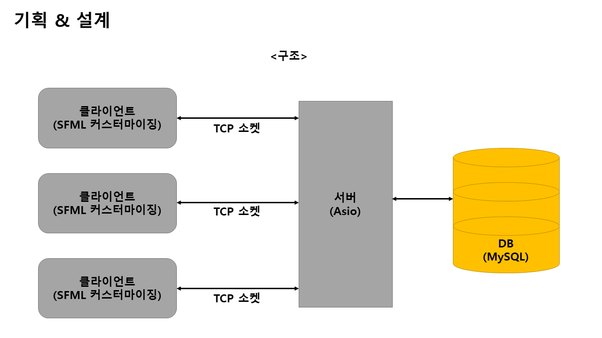
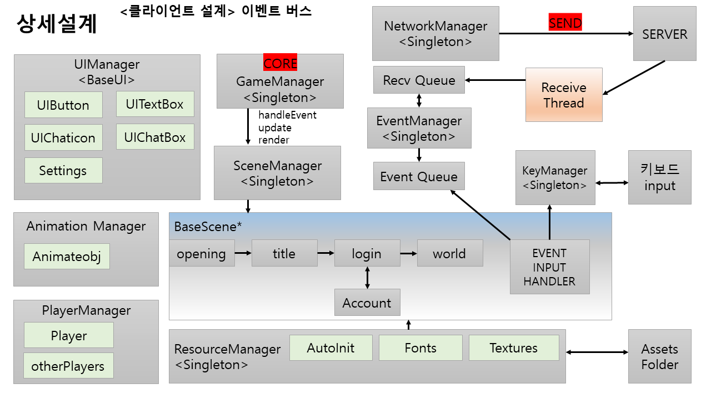
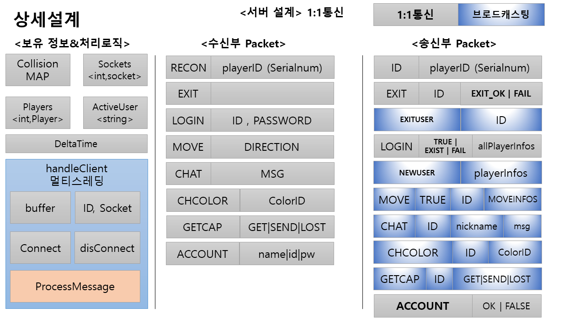

# project_pkmbattle
부경대학교 IOT 개발자과정 강황석준조 미니프로젝트 저장소

## 팀 깃허브 관리 규칙

- 모든 작업은 `main` 브랜치를 기준으로 진행합니다.
- **기능 작업은 반드시 새로운 브랜치를 생성하여 진행** 합니다.
- `main` 브랜치는 팀장이 관리, pull requests 검토 후 merge 합니다.
- `main` 브랜치 업데이트 시 본인 작업중인 branch로 main -> 본인 브랜치 `merge` 해서 **항상 최신화** 해주세요.

- 브랜치 네이밍 규칙
    - 파일명/개발기능
      - 예) 로그인 씬파일에서 로그인 체크 로직 개발중 -> LoginScene.hpp/CheckLogic
      
- 본인 작업중인 파일 외 **다른 사람이 작업중인 파일**은 건드리지 말 것. 그 파일 수정이 필요하다면 담당자에게 수정요청
    - 예) 씬매니저 기능 구현 도중 에러로인해 로그인씬 수정이 필요한 상황인데 누가 로그인씬 작업중임 : 본인이 건드리지말고 작업중인사람한테 수정요청
    - 수정이 필요한데, 다른 사람이 작업중이 아닌경우 : 본인이 할 수 있으면 직접 수정, 아니면 팀장 문의

- 기능 구현이 완료되었으면, Pull requests 올리고 검토 후 main에 커밋, 작업 완료된 branch는 삭제 합니다.
- 그 후 다른 기능 작업시 새로 branch 생성 후 작업합니다.

## 최종 작업물

- 소요기간 3/24 ~ 4/07(80h)
- SFML 커스터마이징을 통한 경량 게임엔진 구축 및 간단한 게임 구현


- 결과물 시연영상

https://github.com/user-attachments/assets/84cec35d-47af-430e-b005-c41f8e3a01e1


https://github.com/user-attachments/assets/baed1588-46ba-40e3-9cab-fe0686d11737


https://github.com/user-attachments/assets/6924b0d0-1939-4f06-a967-2163a51af86c







## 4회차
- 현재 이슈 : 서버기반 움직임으로 인한 버벅임 문제 (2칸씩 움직인다는 등의 현상)
    - 클라이언트 수신시 너무 빠른 응답으로인한 병목현상이 원인 -> 움직임 도중에는 이벤트 처리를 Block 시킴으로 해결.
  
- 클라이언트
    - 게임 종료시 서버로 플레이어 정보 전송 (위치값)

- 서버
    - 플레이어 위치 저장 (DB)
    - 재 시작 시 저장된 위치에 플레이어 스폰
    - 다중 클라이언트로 캐릭터간 충돌 구현

## 3회차

- 서버연동하여 소켓을 통한 로그인 체크로직 구현 (Asio)
- 서버기반 캐릭터 움직임 구현 , 충돌 맵 서버에서 관리
- 로그인 씬 초기화면 ID입력 부분 Focus되게 변경
- 2회차에 해결하지못한 화면전환시 딜레이 발생부분 해결
    - 씬 매니저 리팩토링 후 게임 시작시 게임매니저에서 모든 씬을 등록하는데, 등록해놓고 씬 변경시 또 만드는 코드가 존재했었음,
    - 불필요한 코드 삭제 후 딜레이 대폭 감소. 

- 사운드 on/off 기능 및 UI 구현
- 게임 도중 `ESC` 키로 환경설정 ON/OFF , 환경설정 UI 구현중


## 2회차

프토토타입 영상


https://github.com/user-attachments/assets/6f484d2f-1846-4297-bd3e-3b4b2f093bc3


- 장면전환시 딜레이가 점점 커지는 이슈발생
  - 해결을 위한 행동
    - 리소스매니저 구현
      - 리소스들을 씬 생성 init과 동시에 생성하지말고 게임시작과 동시에 생성하여 필요할때마다 꺼내쓰기로 결정
    - 씬매니저 리팩토링
      - 기존 씬이 넘어갈때마다 동적할당 해제 후 새로 생성하던 방식을 게임시작과 동시에 미리 생성 후 포인터만 변경해주는 방식으로 변경
      - 오버헤드가 줄어들것으로 예상

- 인트로 애니메이션 구현
- 사운드매니저 구현
- 월드맵 충돌 구현
- 캐릭터 움직임 구현

**조원 참고용**
- 3회차부터 해결할 문제들
  - 형우, 석준 , 찬수 : LoginScene.hpp 83행쯤 보면 주석으로 표시한 로그인 로직 서버구현 후 DB데이터 기반으로 로직 짜기
  - 보정, 동관 :
    - font 사용방법변경됨.  기존) 매번 새로 생성자호출 -> 변경) ResourceManager::getInstance().getFont("경로") 로 만들어져있는 폰트 가져와서 사용할 것.
    - SettingsOverlay.hpp 파일 주석처리된 곳에 볼륨조절 버튼 추가해보기
    
## 1회차

프로토타입 영상

https://github.com/user-attachments/assets/87abd840-3464-4a6f-be2d-cfca46fe8132


- 클라이언트부 설계 구현
  


## 개발 환경설정

- vcpkg 및 SFML 설치
    ```shell
    ## C:/Dev/ 로 cd 한 후
    git clone https://github.com/microsoft/vcpkg.git

    cd vcpkg
    .\bootstrap-vcpkg.bat

    .\vcpkg integrate install   ## visual studio 연동

    vcpkg install SFML:x64-windows     ## SFML 설치
    vcpkg install asio             ## asio 설치
    ```

## 개요

- 서버기반 멀티플레이 게임
- 로그인 및 회원가입 기능.
- 오픈월드 에서 플레이어간 상호작용.
- 실시간 채팅 및 미니게임.

 
 ### 설계
- 클라이언트
    - 게임매니저 : 게임의 코어. 모든 매니저들을 모아 게임을 관리하는 매니저 (싱글톤)
    - 씬매니저 : 화면 업데이트와 렌더링을 담당한다. (싱글톤)
        - 베이스 씬 (추상클래스)
            - 여러 씬 (오프닝 , 타이틀 , 로그인 , 월드 , 배틀)

    
    - 타임매니저 : 서버의 타임매니저의 정보를 기반으로 시간 동기화(FPS,DeltaTime) (싱글톤)
    - 키 매니저 : 키보드 및 마우스의 입력을 핸들링하는 매니저 (싱글톤)
    - 네트워크 매니저 : 서버와 통신을 담당하는 매니저
    - 이벤트 매니저 : 수신큐에 저장된 원본 패킷을 이벤트 패킷으로 변환 후 이벤트 큐 삽입
    - 수신 큐 및 이벤트 큐
    - 애니메이션 매니저 : (애니메이션이 들어가는 객체들 모아서 업데이트 및 렌더링)
    - UI 매니저 : UI 컴포넌트 (버튼 및 텍스트박스 등을 모아서 업데이트 및 렌더링)
    - 플레이어 매니저 : 플레이어 관련 이벤트처리 및 렌더링
 
      
- 서버
    - 1클라이언트 당 1개의 쓰레드 할당 (detach) 방식으로 구현

